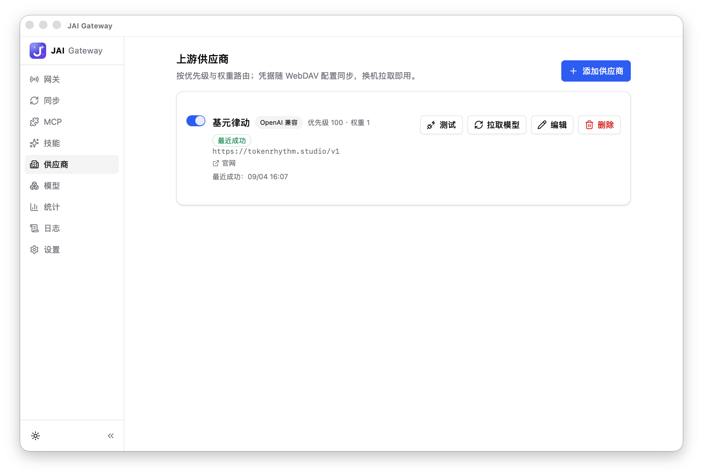
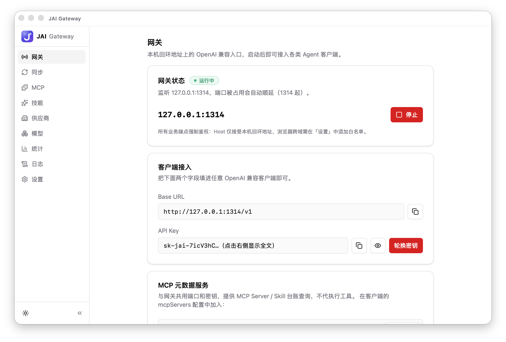
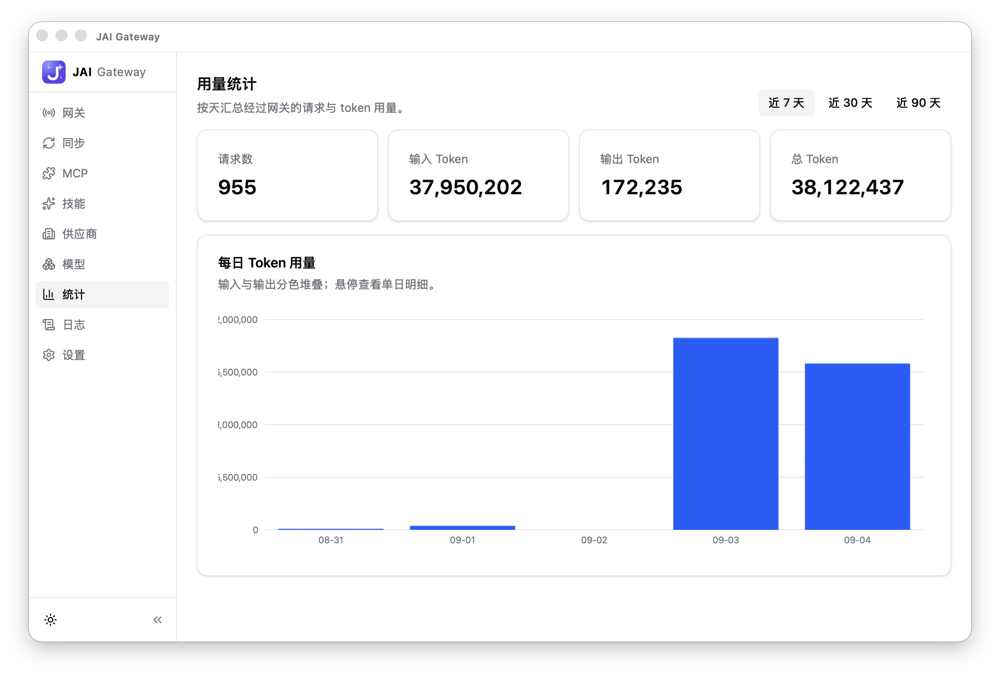
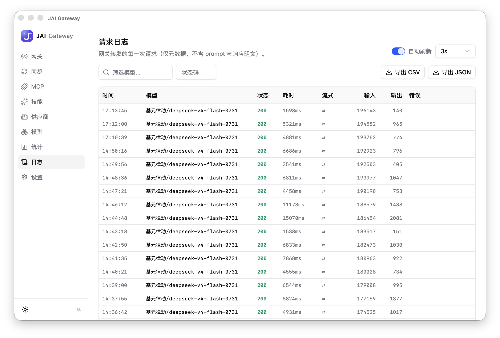

<p align="center">
  
</p>

# JAI — 桌面 AI API 网关

> 开箱即用的本地 AI API 网关：把官方与第三方中转的杂牌 token 来源，收敛成一个稳定的本机入口（`127.0.0.1:1314`），并让多设备（macOS / Windows）配置随 WebDAV 保持同步。

**状态**：M0–M9 全部里程碑完成 · UI 2.0（阶段 0–6）已落地 · WebDAV 多设备同步可靠性加固 · 出站代理配置化 · v0.1.7

---

## 界面预览

| 供应商管理 | 网关接入 |
| --- | --- |
|  |  |
| **用量统计** | **请求日志** |
|  |  |

## 项目架构

JAI 是 Tauri 2 本地应用，分三层：**React 前端 → Tauri 桌面壳 → Rust 网关核心库（gateway-core）**。

```
┌──────────────────────────────────────────────────────────────────┐
│ UI — React 19 + TypeScript + TailwindCSS 4 + shadcn/ui           │
│ Providers · Models · Gateway · Logs · Stats · MCP ·              │
│ Skills · Sync · Settings（共 9 页）                              │
└─────────────────────────────────┬────────────────────────────────┘
                                  │ Tauri IPC（约 60 个命令）
┌─────────────────────────────────▼────────────────────────────────┐
│ 桌面壳 src-tauri — Tauri 2                                       │
│ 网关监督循环（看门狗 + 自动重启）· 系统托盘常驻                  │
│ WebDAV 自动推送（变更防抖 + 定时）· 供应商健康检查               │
└─────────────────────────────────┬────────────────────────────────┘
                                  │ 进程内调用
┌─────────────────────────────────▼────────────────────────────────┐
│ gateway-core — Rust 网关核心库                                   │
│ server      Axum 网关：入站协议线 / 安全中间件 / 代理            │
│ codec       协议中间表示（IR）+ 各协议适配器                     │
│ capability  能力声明 + 兼容性规划（降级/忽略/拒绝）              │
│ router      多渠道路由：优先级故障转移 / 负载均衡                │
│ store       SQLite 唯一事实源（供应商/模型/密钥/日志）           │
│ discover    上游模型自动发现 · sync WebDAV 拉取推送              │
│ mcp         MCP Server 台账 · skills 技能管理                    │
└─────────────────────────────────┬────────────────────────────────┘
                                  │ HTTP 出站（reqwest）
            ┌───────────────┬─────┼─────────┬─────────────┐
            ▼               ▼               ▼             ▼
    openai_compat   openai_responses    anthropic      gemini
```

### 协议双轨制（架构核心）

网关的协议转换层按「**同族直通，跨族才转换**」设计（详细规格见 [docs/design/protocol-ir.md](docs/design/protocol-ir.md)）：

- **同族直通**：入站协议族与出站供应商同族时走**字节级直通**——只改写上游 URL 与鉴权头，body 原样转发。零损耗，缓存控制、citations 等未建模特性原样保留。
- **跨族转换**：解码 → 统一中间表示（IR）→ 编码。IR 先归一三大结构性差异：system 提示词位置、tool 结果载体、stop reason 枚举，使任意客户端协议都能组合任意上游模型（含 tool calling）。
- **能力声明 + 兼容性规划**（[protocol-ir §10](docs/design/protocol-ir.md)）：每个出站协议族声明六面能力表（参数/工具/tool_choice/响应格式/reasoning/流式 usage），跨族转换前先规划——原生支持直传、可降级执行、无法表达才 400 拒绝；降级与 Lenient 丢弃进结构化日志（`CapabilityWarn`，UI 日志页可见）。
- 日志采集在直通路径上做旁路轻量扫描（抓 usage 数字），不做语义级解析。

### 桌面壳关键机制

- **网关监督循环**：独立任务常驻，异常退出自动重启（带重启计数），端口被占时自动顺延
- **托盘常驻**：关闭窗口只隐藏到托盘，网关保持运行；真正退出走托盘菜单
- **WebDAV 自动推送**：配置变更防抖合并 + 定时推送；手动推/拉与其互斥，推送前留存本地快照
- **供应商健康检查**：每 10 分钟一轮探测全部启用供应商，状态跃迁时发系统通知
- **SQLite 迁移 + 异步日志管道**：启动即应用迁移，失败即中止启动（早拦截）；日志经有界队列异步落库，不影响请求主路径

## 技术栈

| 层 | 选型 |
| --- | --- |
| 桌面框架 | Tauri 2.0（macOS / Windows） |
| 后端 | Rust · Axum（HTTP 网关）· Reqwest（出站）· rusqlite（SQLite） |
| 前端 | React 19 + TypeScript + TailwindCSS 4 + shadcn/ui + recharts + react-hook-form/zod |
| 存储 | SQLite（供应商 / 模型 / 网关密钥 / 请求日志 / meta） |
| 同步 | WebDAV（jai-export/v1 导出协议，last-write-wins） |
| 更新 | GitHub Releases + tauri-plugin-updater（minisign 签名校验） |

## 核心特性

- 多供应商管理：OpenAI 兼容 / OpenAI Responses / Anthropic / Gemini 四族渠道；凭据明文存本地 SQLite（与网关 Key 同级安全模型，安全性依赖数据目录文件权限）
- **配置随 WebDAV 同步**：供应商 API Key、网关 Key、WebDAV 密码随导出同步，换机器拉取即用（客户端零改动）；手动重新生成网关 Key 自动更新远端；推送前自动留存远端上一版时间戳备份 + 本地快照，自动推送带「空配置不覆盖远端」护栏（last-write-wins）
- 对外暴露统一网关入口（`127.0.0.1:1314`），支持多条入站协议线：
  - OpenAI `POST /v1/chat/completions` 与旧版 `POST /v1/completions`
  - OpenAI Responses API `POST /v1/responses`
  - Anthropic `POST /v1/messages`（Claude Code 直连，含 `count_tokens` 粗估）
  - MCP 元数据服务 `POST /mcp`（Streamable HTTP）：把网关登记的 MCP Server / Skill 台账以 MCP 协议暴露给 Agent——`list_mcp_servers` / `get_mcp_server_detail` / `get_tool_schemas` / `list_skills` / `get_skill_detail` 五个只读工具，不注入对话链路、不代执行工具；env 仅回键名不回值
- 同名模型多渠道路由：按优先级自动故障转移 + 健康感知排序 + 同优先级权重负载均衡
- 模型别名/映射：每个模型可配置发给上游的真实模型 ID
- 跨协议转换（含 tool calling）：让任意客户端组合任意上游模型
  - **结构化输出降级执行**：客户端请求 `response_format(json_schema)` 时——openai 系上游原生外传；anthropic/gemini 上游降级为「提示词指令注入 + 输出 JSON 校验」（strict 校验失败返回 502）
  - **reasoning effort 闭环**：入站 `reasoning_effort` / `reasoning.effort` 建模后按目标族映射——Native 透传、Anthropic 转 `thinking` 开/关、无能力族忽略并 WARN
  - **Codex 扩展工具折叠还原**（[protocol-ir §10](docs/design/protocol-ir.md)）：`shell` / `apply_patch` / `custom` / `local_shell` 声明与调用折叠为 function 工具（Codex 客户端可接任意普通模型），回程按工具身份映射还原原始 item（含流式 item 类型与增量事件名）
- 上游模型自动发现：从供应商 `/models` 拉取模型并入库，自动填上下文窗口/最大输出缺省值
- MCP / 技能（Skill）管理：网关内登记 MCP Server 与技能（连通检查、工具查看、ZIP 批量导入、Markdown 导出）；MCP 配置导入自动识别三种格式——`{"mcpServers":{...}}` JSON、`codex mcp add` 命令行、Codex `[mcp_servers.*]` TOML 片段
- 应用内更新：设置页一键检查 / 下载 / 安装 GitHub Releases 最新版本（minisign 签名校验，重启生效）
- 请求日志（仅元数据）与用量统计可视化（recharts 堆叠柱状图，近 7/30/90 天；可配保留天数/行数上限）
- **UI 2.0**：明暗双主题（跟随系统）、可折叠侧边栏、shadcn/ui 组件体系、表单校验就地展示（react-hook-form + zod）、自绘标题栏 + 窗口毛玻璃特效
- 安全基线：强制鉴权（常量时间比对）、Host/Origin 校验、CORS 默认拒绝、鉴权失败限速、推送前快照

## 重点支持客户端

JAI 当前专注适配两个国产 Agent，协议直通与跨族转换对其透明可用：

- **DeepSeek Harness（dsh）**：第一优先客户端，Chat Completions 与 Responses 两条协议线均作为适配目标——选择 `openai-completions`（Chat）或 `openai-responses`（Responses）协议线接入。
- **zcode**：协议线确认后纳入同等适配。

接入配置：baseURL `http://127.0.0.1:1314/v1`，API Key 用网关 Key（`sk-jai-*`，见应用「网关」页，同页提供各客户端内置接入示例）。

> 💡 Windows 提示：JAI（reqwest）不读 Windows 系统代理，访问需代理的上游时需以 `HTTPS_PROXY=http://127.0.0.1:7890` 启动，否则对需代理的上游返回 502 `all_providers_failed`。

其他客户端（Claude Code、Codex、Continue 等）经协议直通仍可使用，但不在专属适配范围内。

## 使用 · 快速接入

### 任意 OpenAI 兼容客户端

```bash
OPENAI_API_BASE=http://127.0.0.1:1314/v1
OPENAI_API_KEY=sk-jai-xxxx
```

同名模型可配置多个渠道，按优先级自动故障转移（一级 5xx/429/超时 → 顺延下一渠道）。

### Claude Code（Anthropic 线）

```bash
ANTHROPIC_BASE_URL=http://127.0.0.1:1314
ANTHROPIC_AUTH_TOKEN=sk-jai-xxxx            # 或 ANTHROPIC_API_KEY=sk-jai-xxxx
claude
```

要求：供应商页添加一个 **Anthropic** 协议族渠道并录入上游 Key，模型列表存在 Claude 型号（如 `claude-sonnet-4-5`）且启用。多轮对话、工具调用、prompt caching 走字节级直通；`count_tokens` 由网关粗估返回，避免客户端降级。

### MCP 元数据服务（/mcp）

在任意支持 MCP 的客户端（dsh / Claude Code / Continue 等）的 `mcpServers` 配置中加入（应用「网关」页有同款配置，**点「复制配置」自动填入真实密钥**）：

```json
{
  "mcpServers": {
    "jai-registry": {
      "type": "http",
      "url": "http://127.0.0.1:1314/mcp",
      "headers": { "Authorization": "Bearer <网关密钥>" }
    }
  }
}
```

接入后 Agent 可查询网关登记的 MCP Server / Skill 台账（五个只读工具）。该服务只提供发现与信息，不代执行工具。

## 开发

### 目录结构

```
JAI/
├── crates/gateway-core/    # 网关核心库（协议/路由/存储/同步/MCP/Skill）
├── src-tauri/              # Tauri 桌面壳（IPC 命令/托盘/网关监督）
├── ui/                     # React 前端（pages/ + components/ + lib/）
├── scripts/                # 开发与构建脚本（dev.sh 等）
└── docs/                   # 需求与设计文档（见下方索引）
```

### 本地开发启动

```bash
pnpm install            # 根工作区依赖
pnpm --dir ui install   # 前端依赖
bash scripts/dev.sh     # 一键启动：Vite + Tauri 桌面壳
```

- Vite 固定监听 `http://127.0.0.1:5173`
- 网关默认监听 `http://127.0.0.1:1314`
- 健康检查：`curl http://127.0.0.1:1314/healthz`
- 前端构建门禁：`pnpm --dir ui build`（`tsc --noEmit` + `vite build` 零错误）
- 质量门禁：`bash scripts/regression.sh`（开发期一键检查）

## 文档索引

| 文档 | 内容 |
| --- | --- |
| [docs/需求主文档](docs/) —— 见仓库根《JAI — 桌面 AI API 网关.md》 | 需求全量定义与评审记录 |
| [docs/design/protocol-ir.md](docs/design/protocol-ir.md) | 协议中间表示、逐字段映射总表、行为规范 |
| [docs/design/storage-schema.md](docs/design/storage-schema.md) | SQLite 表结构、密钥管理、日志策略 |
| [docs/design/roadmap.md](docs/design/roadmap.md) | M0–M9 里程碑路线图、稳定性基线 |
| [docs/superpowers/specs/2026-08-31-ui-framework-upgrade-design.md](docs/superpowers/specs/2026-08-31-ui-framework-upgrade-design.md) | UI 2.0 设计 spec（阶段 0–6） |
| [docs/zcode接入.md](docs/zcode接入.md) | zcode 接入 JAI 与 MCP/Skill 加载指南 |
| [docs/design/release.md](docs/design/release.md) | 签名/公证/更新通道/发布检查单 |

## License

[MIT](./LICENSE)